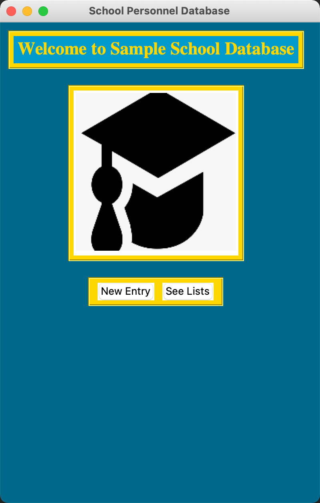
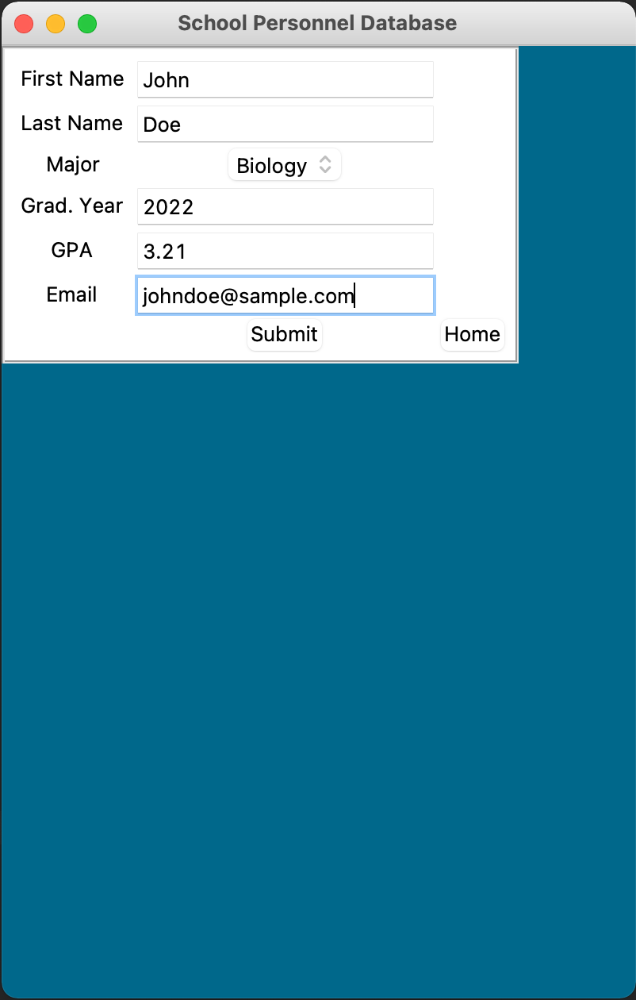
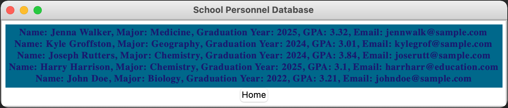

# SchoolPersonnelSystem
This program creates a fully functional personnel database app where the user can input either Faculty, Staff or Students onto their respective lists!
- Language: Python
- GUI: tKinter
- Database: SQLite
- Other libraries: DateEntry from tkCalendar

 

